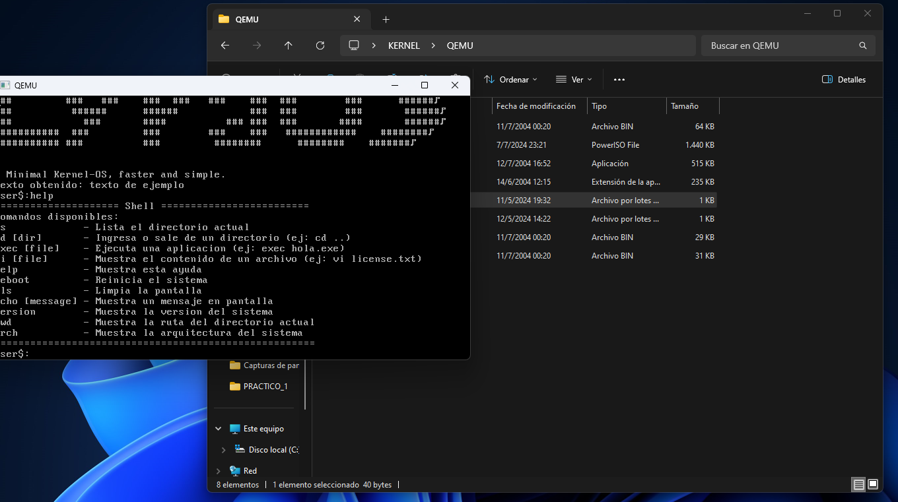

# Kernel LYRA OS



**Kernel LYRA OS** es un núcleo ligero programado en C que implementa una mínima porción de las bibliotecas estándar de C (`libc`) y se basa en partes de otros proyectos de kernels. Este proyecto tiene como objetivo proporcionar una base sólida para el desarrollo de sistemas operativos personalizados, integrando componentes de proyectos como LuxurOS, NuOS y Visopsys.

---

## Tabla de Contenidos

1. [Fuentes](#fuentes)
2. [Información Adicional](#información-adicional)
   - [Entorno de Compilación](#entorno-de-compilación)
   - [Registro de Componentes](#registro-de-componentes)
   - [Estructura del Proyecto](#estructura-del-proyecto)
   - [Características del Sistema de Archivos](#características-del-sistema-de-archivos)
   - [Interfaz del Usuario](#interfaz-del-usuario)
   - [Encabezados y Enlaces](#encabezados-y-enlaces)
   - [Archivo `ia32.c`](#archivo-ia32c)
   - [Llamadas al Sistema (`syscall.c`)](#llamadas-al-sistema-syscallc)
   - [Identificadores para `printf`](#identificadores-para-printf)
3. [Cronología de Desarrollo](#cronología-de-desarrollo)
4. [Resumen del Proyecto](#resumen-del-proyecto)
   - [Características Clave](#características-clave)
   - [Herramientas Utilizadas](#herramientas-utilizadas)
   - [Desafíos y Soluciones](#desafíos-y-soluciones)
5. [Cómo Ejecutarlo](#cómo-ejecutarlo)
6. [Contribuciones](#contribuciones)
7. [Licencia](#licencia)

---

## Fuentes

### Cómo Crear una ISO Bootable con el Menú GRUB
- **Guía:** [Invoking grub-mkrescue](https://www.gnu.org/software/grub/manual/grub/html_node/Invoking-grub_002dmkrescue.html#Invoking-grub_002dmkrescue)

### Proyectos de Sistemas Operativos
- **LuxurOS:** [SourceForge - LuxurOS](https://sourceforge.net/projects/luxur/)
- **NuOS:** [SourceForge - NuOS](https://sourceforge.net/projects/nuos/)
- **Visopsys:** [Visopsys Official Site](https://visopsys.org/)
- **Linux (Torvalds):** [GitHub - torvalds/linux](https://github.com/torvalds/linux)
- **Linux 1.0 (Kalamangga):** [GitHub - kalamangga-net/linux-1.0](https://github.com/kalamangga-net/linux-1.0)
- **Lux Kernel (Tadryanom):** [GitHub - tadryanom/lux](https://github.com/tadryanom/lux)

---

## Información Adicional

### Entorno de Compilación
- **Sistema Operativo:** Ubuntu 16.04 LTS x86 (compatibilidad actual con 32 bits).
- **Compilador GCC:** Versión 5.4.0 (`gcc version 5.4.0 20160609 (Ubuntu 5.4.0-6ubuntu1~16.04.12)`).
- **Kernel de Linux Utilizado:**
  ```
  Linux osboxes 4.15.0-142-generic #146~16.04.1-Ubuntu SMP Tue Apr 13 09:26:57 UTC 2021 i686 i686 i686 GNU/Linux
  ```

### Registro de Componentes
- **Fuente Principal:** Componentes obtenidos principalmente de **LuxurOS**.
- **Librerías Extraídas:**
  - **`ia32.c`:** Extraída de **NuOS**.
  - **Visopsys:** Librerías provenientes de **Visopsys**, un sistema operativo en C con interfaz gráfica.
  - **Tiempo y CMOS:** Librerías de tiempo y CMOS extraídas de **Lux-kernel**.
- **Inspiración:** Diseño basado en **Linux** y comentarios adicionales.

### Estructura del Proyecto
- **Makefile:** 
  - **Función:** Compila y enlaza todos los archivos en un único ejecutable compatible con GRUB.
  - **Proceso:** Verificación y reescritura del código utilizando ChatGPT.
- **Organización de Carpetas:**
  - **`boot`:** Contiene el archivo `boot.S` en ensamblador, extraído de otro código.
  - **`include`:** Contiene las cabeceras del sistema.
  - **`kernel`:** Contiene el núcleo (kernel) del sistema.
  - **`lib`:** Contiene las librerías compilables, reducidas a `lib.o`.

### Características del Sistema de Archivos
- **FAT12:**
  - **Capacidad:** Soporta hasta 16 MB de memoria por clúster, adecuado para sistemas empotrados.
  - **Imagen (IMG):** Capacidad de 1.44 MB (1440 KB).

### Interfaz del Usuario
- **Shell Básico:**
  - **Funciones:** Incluye ayuda y funciones esenciales para la interacción del usuario.
  - **Integración:** Todas las funciones del sistema están enlazadas dentro de `stdio.h` y las estructuras con tipos enteros se encuentran en `stddef.h`.

### Encabezados y Enlaces
- **`include/boot/multiboot.h`:**
  - **Contenido:** Estructuras básicas para arrancar ELF con GRUB, esencial para el arranque de programas escritos en C.
  - **Fuente:** Puede ser extraída de cualquier repositorio compatible.
  - **Archivo de Enlace (`link.ld`):**
    - **Formato 32 bits:**
      ```ld
      .text 0x100000 :
      ```
    - **Formato 64 bits:**
      ```ld
      .text = 0x10000200000;
      ```
  - **Configuración:** Se añade el entero de 32 bits más la capacidad de memoria del computador.

### Archivo `ia32.c`
- **Función Principal:** Contiene diversas funciones, destacando `reboot`, que interactúa con la salida del procesador para reiniciar el sistema.

### Llamadas al Sistema (`syscall.c`)

| Función        | Identificador |
|----------------|----------------|
| `cls`          | 0              |
| `puts`         | 1              |
| `gets`         | 2              |
| `file_open`    | 3              |
| `sleep`        | 4              |
| `shell`        | 5              |
| `putchar`      | 6              |
| `kprintf`      | 7              |
| `exec`         | 8              |
| `cd`           | 9              |
| `get_file_size`| 10             |
| `ls`           | 11             |

### Identificadores para `printf`

| Formato | Descripción                        |
|---------|------------------------------------|
| `%d`    | Enteros                            |
| `%f`    | Números de punto flotante          |
| `%s`    | Cadenas                            |
| `%p`    | Punteros                           |
| `%u`    | `unsigned int`                     |
| `%zu`   | Unidades de tiempo (`size_t`)      |

---

## Cronología de Desarrollo

### Mayo 2024
- **05/12/24:**
  - Creación de un repositorio privado en GitHub para almacenar los archivos: [GitHub - jerenat/os-test](https://github.com/jerenat/os-test).

- **05/12/24:**
  - Creación del archivo `Makefile` para compilar el kernel junto con todas sus librerías utilizando GCC.

### Junio 2024
- **02/06/24:**
  - **Adición de librerías en C:**
    - **`rtc.c`:** Gestión del reloj en tiempo real (Real-Time Clock), esencial para el temporizador del procesador.
    - **`time.c`:** Manejo del tiempo, incluye UTC/UTF, mide unidades de tiempo en segundos y sirve como semilla para números aleatorios.
    - **`io.h`:** Cabecera que define entradas y salidas del procesador, implementadas con ensamblador en línea (`__asm__ volatile`).
    - **`rand.c`:** Genera números aleatorios de 0 a 65535 (x64). Modificaciones en `printf.c` para soportar `%u`, `%zu`, `%d`.
    - **`stddef.h`:** Contiene tipos de datos como `int8_t`, `int16_t`, `int32_t`, `int64_t`, `size_t`, `NULL`.
    - **`isdigit.c`:** Verifica si un carácter es un dígito, parte de la biblioteca estándar (`LIBC`).
  - **Incorporación de Cabeceras en `include/time`:**
    - **`io.h`:** Componentes de Entrada y Salida de datos en el procesador (escrito en ASM y traducido a C).
    - **`rand.h`:** Semilla del temporizador para generar números aleatorios.
    - **`rtc.h`:** Gestión de los ciclos de reloj de CMOS.
    - **`time.h`:** Manejo del tiempo basado en `rtc.h`.

- **07/06/24:**
  - **Función `rtc.c`:** Creación de `sleep_seconds(segs);`, que proporciona una pausa de `segs` segundos basada en el reloj del CMOS.
  - **Adición de Múltiples Funciones:**
    - **`strtok.c`:** Divide una cadena en tokens basados en delimitadores.
    - **`strstr.c`:** Encuentra la primera ocurrencia de una subcadena dentro de otra cadena.
    - **`strrchr.c`:** Encuentra la última ocurrencia de un carácter específico en una cadena.
    - **`strncpy.c`:** Copia una cantidad específica de caracteres desde una cadena de origen a una de destino.
    - **`strncmp.c`:** Compara los primeros `n` caracteres de dos cadenas.
    - **`strcspn.c`:** Determina la longitud del segmento inicial de una cadena que no contiene caracteres de otra cadena.
    - **`strchr.c`:** Encuentra la primera ocurrencia de un carácter específico en una cadena.
    - **`sqrt.c`:** Calcula la raíz cuadrada de un número.
  - **Diferenciación de Funciones:**
    - **`timer` y `rtc`:** Ambas interactúan con la memoria de reloj del CMOS, pero cumplen funciones diferentes.
  - **Adición de `version.h`:** 
    - **Función:** Trabaja con GCC para programar, contiene la versión del kernel y la fecha de compilación.
  - **Creación de Cabeceras:**
    - **`math.h`:** Operadores matemáticos.
    - **`stdbool.h`:** Operadores lógicos `true` y `false`.
    - **`string.h`:** Funciones de manejo de cadenas de texto.

---

## Resumen del Proyecto

**Kernel LYRA OS** es un núcleo de sistema operativo personalizado diseñado para ser compatible con la especificación Multiboot, permitiendo su carga a través de GRUB. El proyecto integra diversas librerías y componentes de proyectos existentes como LuxurOS, NuOS y Visopsys, además de adaptaciones basadas en el kernel de Linux, ofreciendo una base robusta y modular para el desarrollo de sistemas operativos.

### Características Clave

- **Compatibilidad Multiboot:** Permite el arranque a través de GRUB utilizando un encabezado Multiboot correctamente configurado.
- **Sistema de Archivos FAT12:** Soporte para hasta 16 MB por clúster, adecuado para sistemas empotrados.
- **Shell Básico:** Incluye comandos esenciales como `ls`, `cd`, `exec`, `vi`, `help`, `reboot`, `cls`, `echo`, `version`, `pwd`, y `arch`.
- **Gestión de Memoria y Librerías:** Utiliza un `Makefile` para compilar y enlazar todas las librerías en un único archivo ejecutable.
- **Funciones del Sistema:** Implementación de múltiples llamadas al sistema para manejar operaciones básicas y avanzadas.
- **Estructura Modular:** Organización clara de carpetas y archivos para facilitar el mantenimiento y la expansión del proyecto.

### Herramientas Utilizadas

- **Compilador:** GCC versión 5.4.0.
- **Sistema Operativo de Desarrollo:** Ubuntu 16.04 LTS x86.
- **Control de Versiones:** GitHub (repositorio privado).

### Desafíos y Soluciones

- **Compatibilidad de 32 Bits:** Adaptación del kernel para funcionar exclusivamente en arquitecturas de 32 bits.
- **Generación de Números Aleatorios:** Modificación de `printf.c` para soportar nuevos formatos y asegurar la correcta generación de números aleatorios.
- **Gestión del Tiempo:** Implementación de funciones para manejar el tiempo real y pausas basadas en el reloj del CMOS.
- **Integración de Librerías Externas:** Adaptación y extracción de librerías de proyectos existentes para integrarlas en el núcleo personalizado.

---

## Cómo Ejecutarlo

1. **Preparación:**
   - Asegúrate de tener instalado **Ubuntu 16.04 LTS x86** y el **GCC 5.4.0**.

2. **Clonar el Repositorio:**
   ```bash
   git clone https://github.com/jerenat/os-test.git
   cd os-test
   ```

3. **Compilar el Kernel:**
   - Ejecuta el siguiente comando para compilar el kernel junto con todas sus librerías:
     ```bash
     make
     ```

4. **Crear la Imagen Bootable:**
   - Utiliza el script proporcionado para crear una ISO bootable con GRUB:
     ```bash
     ./START_IMG.cmd
     ```

5. **Arrancar el Sistema:**
   - La imagen `.img` estará disponible en la carpeta `qemu`. Puedes arrancarla usando un emulador como QEMU:
     ```bash
     qemu-system-i386 -cdrom path/to/your.img
     ```

---

## Contribuciones

¡Las contribuciones son bienvenidas! Si deseas contribuir a este proyecto, por favor sigue estos pasos:

1. **Fork del Proyecto**
2. **Crear una Rama para tu Feature (`git checkout -b feature/nueva-feature`)**
3. **Commit de tus Cambios (`git commit -m 'Añadir nueva feature')`**
4. **Push a la Rama (`git push origin feature/nueva-feature`)**
5. **Abrir un Pull Request**

Por favor, asegúrate de que tu código siga las normas de estilo y que todas las pruebas pasen antes de enviar un Pull Request.

---

## Licencia

Este proyecto está licenciado bajo la [MIT License](LICENSE).

---

## Contacto

Para cualquier consulta o sugerencia, por favor contacta a [jere8886@gmail.com](mailto:jere8886@gmail.com).

---

**Nota:** Este proyecto está en fase de desarrollo y puede contener errores. Se recomienda utilizarlo únicamente con fines educativos y de prueba.
